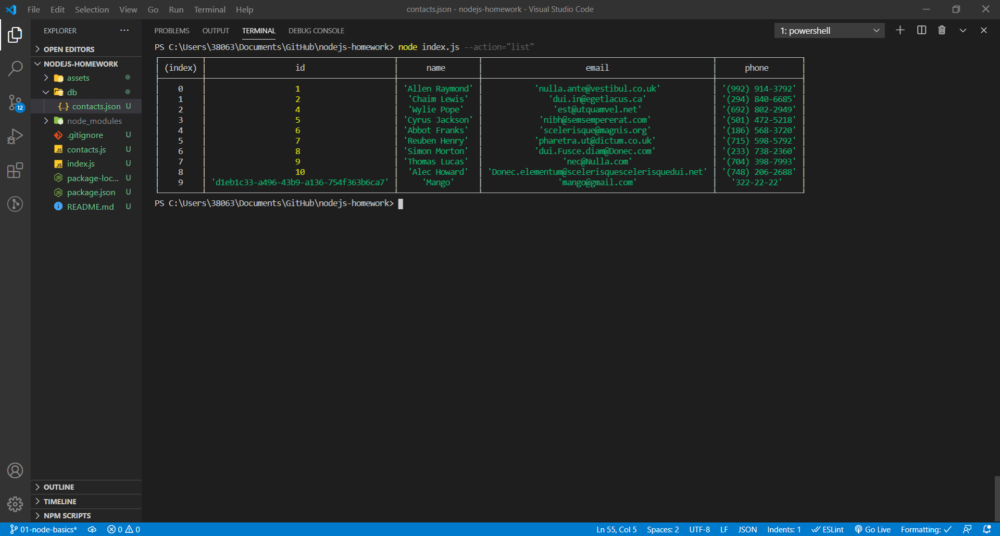
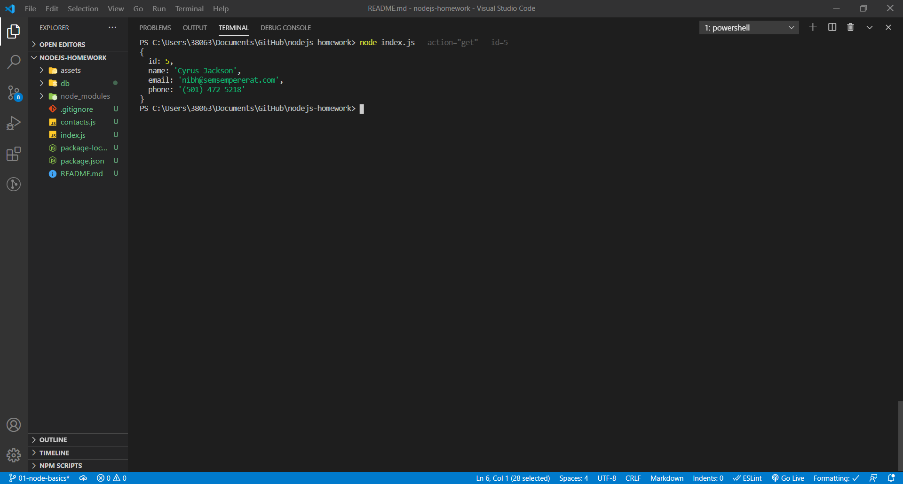
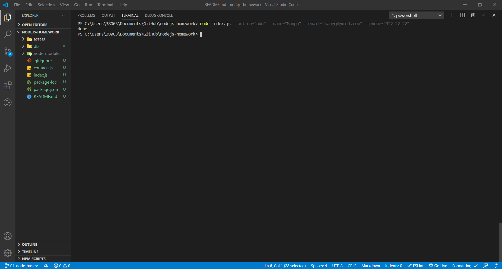
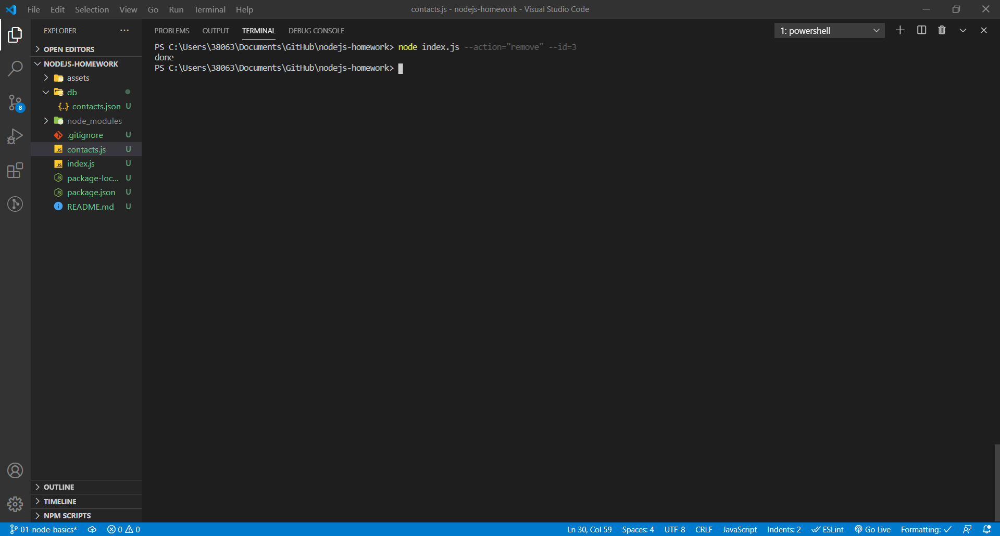

# nodejs-homework
goit nodejs homework-01

[Link to the task](https://github.com/goitacademy/nodejs-homework/blob/master/homework-01/README.md)

# Получаем и выводим весь список контактов в виде таблицы (console.table)

```sh
node index.js --action="list"
```


# Получаем контакт по id

```sh
node index.js --action="get" --id=5
```


# Добавялем контакт

```sh
node index.js --action="add" --name="Mango" --email="mango@gmail.com" --phone="322-22-22"
```


# Удаляем контакт

```sh
node index.js --action="remove" --id=3
```

